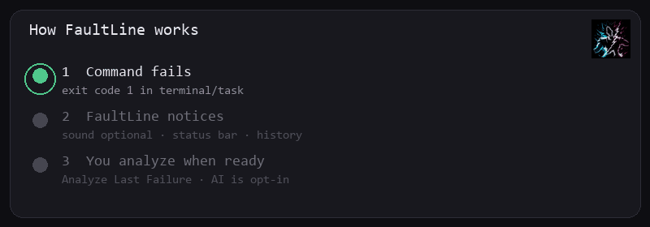
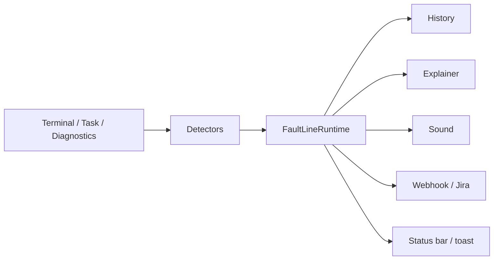

# FaultLine Architecture

<p align="center">
  
  
</p>

How FaultLine is built.

- **Part 1:** product map in simple language  
- **Part 2:** folders, lifecycle, packaging for contributors  

Related: [README](./README.md) · [SECURITY](./SECURITY.md) · [CONTRIBUTING](./CONTRIBUTING.md)

---

# Part 1. Simple map

## Product order

1. **Debugger and fault explainer**  
   Capture failure context. Explain on demand (or auto if the user enables it).  
2. **Error notifier**  
   Optional sound, status bar, toast, webhook, Jira.  

FaultLine is a VS Code extension (no separate server). It runs in the editor host.

<p align="center">
  
</p>



## Main pieces

| Piece | Job |
|-------|-----|
| Detectors | Emit failure (and optional success) events |
| Runtime | Sanitize, mute, store history, fan out |
| Scheduler | Snooze, quiet hours, sound cooldowns |
| Explainer service | Talk to Copilot or HTTP providers |
| Webhook service | HTTPS outbound and optional Jira |
| Webviews | Settings, Error Analysis, Welcome |
| Secret manager | Provider and integration keys |

## Failure path (runtime order)

1. Detector fires (`shell` / `task` / `terminal` / `diagnostics`)  
2. Full mute check (disabled, snooze, quiet hours, focus)  
3. Redact label and output  
4. Ignore patterns and branch patterns (branch fails closed if unknown)  
5. Optional sound (cooldown / max-per-minute)  
6. History (capped, redacted)  
7. Webhook / Jira if configured  
8. Status bar and notification  
9. Explainer panel if enabled and auto-show is on (default: user opens it)  

---

# Part 2. Technical map

## Repository layout

```text
src/
  extension.ts                      # activate / deactivate / config reload
  application/
    runtime/faultline.ts            # handleFailure / handleSuccess
    core/                           # AudioPlayer, SoundResolver, WSL
  infrastructure/
    detectors/                      # terminal, task, diagnostic
    services/                       # explainer providers, webhooks, Jira
    security/pii.ts
    state/stateStore.ts
  presentation/
    commands/                       # sound / state / UI commands
    ui/                             # settings, error analysis, welcome, status bar
  shared/
    config/                         # ConfigManager, SecretManager, constants
    utils/                          # scheduler, history, logger, i18n, git
  test/                             # Jest unit + integration smoke
resources/
  packs/                            # built-in audio
  vendor/                           # toolkit and codicon assets
  faultline-logo.png
scripts/
  sync-vendor.js
  make-docs-gifs.py
docs/media/                         # logo-pulse, terminal-fail, how-it-works
```

## Detectors

| Detector | Source id | Mechanism |
|----------|-----------|-----------|
| TerminalDetector | `shell` | Shell execution start/end, `read()` buffer, `exitCode`, `commandLine`, WeakMap |
| TerminalDetector | `terminal` | Terminal closed with non-zero exit |
| TaskDetector | `task` | Task process start/end, optional success, branch filter |
| DiagnosticDetector | `diagnostics` | Debounced diagnostics + threshold |

Detectors use a live `() => FaultLineConfig`.  
Config changes do not rebind listeners by default (`affectsDetectors` is false).

## Runtime

Public surface for commands:

- `configManager`, `secretManager`, `scheduler`, `player`, `resolver`  
- `history`, `ai`, `webhook`, `errorExplanation`, `statusBar`  
- `extensionPath`  

Dispose is idempotent.

## Configuration

- Section: `faultline.*`  
- `ConfigManager` clamps numbers and compiles ignore regexes (count and length caps)  
- Settings webview writes allowlisted keys only  
- Secrets stay in SecretStorage  

## Explainer providers

Registry in `aiProviders.ts`:

- Builtin: Copilot via `vscode.lm`  
- HTTP: OpenRouter, Groq, Gemini, Hugging Face, Mistral, Together, Cohere, OpenAI, Anthropic  

Chat path:

1. Redact  
2. Load key when required  
3. Timeout wrapper  

Tests mock `fetch` and check URL and auth shapes.

## Webhooks and Jira

```text
postWebhook
  -> evaluateWebhookUrlResolved
  -> https.request({ host: connectHost IP, servername: original host })
  -> retries re-run DNS and pin
```

```text
jiraEnabled?
  -> evaluateJiraUrl
  -> Basic auth email + SecretStorage token
  -> POST {origin}/rest/api/3/issue
  -> rate limit 30s
```

## UI / webviews

| Panel | Purpose |
|-------|---------|
| Settings | Core config and provider keys |
| Error Analysis | Fault explainer and follow-up chat |
| Welcome | First install greeting (optional) then setup UI |

### Welcome / first install

```text
First install (or major version jump)
  -> WelcomePanel.createOrShow(uri, withIntro: true)
  -> Typing greeting (Anurag Mishra, for developers who ship)
  -> Skip under the text  OR  typing finishes
  -> Main welcome body

Command: FaultLine: Show Welcome Screen
  -> createOrShow(uri, withIntro: false)
```

`localResourceRoots` = `resources` only.

## Packaging

| Step | Output |
|------|--------|
| `npm run vendor:sync` | `resources/vendor/**` |
| `npm run compile` | `out/extension.js` |
| `vsce package` | Slim VSIX; no `src`, `coverage`, or `node_modules` tree |

## Testing

| Layer | Examples |
|-------|----------|
| Unit | SSRF, redaction, detectors, handleFailure, i18n, sound path |
| Integration smoke | `activate()` and command registration |
| CI | Multi-OS lint/test/compile, VSIX checks |
| Release | Tag `v*` attaches `faultline.vsix` |

## Extension points

| Want to… | Start here |
|----------|------------|
| New detector | `infrastructure/detectors/` + runtime register |
| New explainer provider | `aiProviders.ts` + tests |
| New setting | `package.json` + `ConfigManager` + types |
| New command | `presentation/commands/*` + `package.nls.json` |

---

<p align="center">
  <sub>FaultLine Architecture · 3.5.0 · Anurag Mishra · MIT</sub>
</p>
