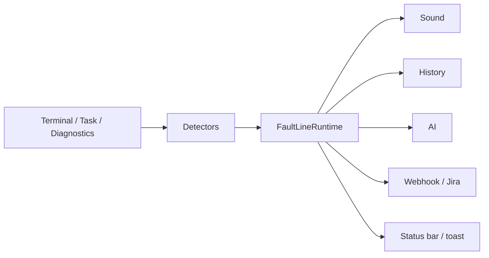

# FaultLine Architecture

<p align="center">
  
  
</p>

This document explains **how FaultLine is built**.  

- **First half:** simple map (product + flow)  
- **Second half:** folders, lifecycle, packaging (for contributors)

Related: [README](./README.md) · [SECURITY](./SECURITY.md) · [CONTRIBUTING](./CONTRIBUTING.md)

---

# Part 1 — Simple map (everyone)

## What the extension does

FaultLine is a **VS Code extension** (not a separate server).  
It runs inside your editor and:

1. Listens for failures (terminal / tasks / optional diagnostics)  
2. Decides whether to notify you (mute, quiet hours, ignore patterns, branch filters)  
3. Optionally plays audio  
4. Optionally talks to AI or webhooks / Jira  
5. Remembers recent failures for “analyze last error”



## Big pieces in plain language

| Piece | Job |
|-------|-----|
| **Detectors** | “Something failed” events |
| **Runtime** | Central brain — sanitize, mute, fan-out |
| **Scheduler** | Snooze, quiet hours, cooldowns |
| **AI service** | Talk to Copilot or HTTP providers |
| **Webhook service** | Safe HTTPS outbound + optional Jira |
| **Webviews** | Settings UI + Error Analysis chat |
| **Secret manager** | API keys in SecretStorage |

## Failure path (user-visible order)

1. Detector fires (`shell` / `task` / `terminal` / `diagnostics`)  
2. Full mute check (disabled / snooze / quiet hours / focus)  
3. **PII sanitize** on label + output  
4. Ignore patterns + branch patterns (branch **fail-closed** if unknown)  
5. Sound (if allowed by cooldown / max-per-minute)  
6. History (capped, sanitized)  
7. Webhook / Jira (if configured)  
8. Status bar + notification  
9. AI panel only if enabled **and** auto-show (default: you open it yourself)

---

# Part 2 — Technical map (developers)

## Repository layout

```text
src/
  extension.ts                      # activate / deactivate / config reload
  application/
    runtime/faultline.ts            # handleFailure / handleSuccess
    core/                           # AudioPlayer, SoundResolver, WSL
  infrastructure/
    detectors/                      # terminal, task, diagnostic
    services/                       # AI providers, AIService, WebhookService
    security/pii.ts
    state/stateStore.ts
  presentation/
    commands/                       # sound / state / UI commands
    ui/                             # settings, error analysis, welcome, status bar
  shared/
    config/                         # ConfigManager, SecretManager, constants
    utils/                          # scheduler, history, logger, i18n, git
  test/                             # Jest unit + integration smoke
resources/
  packs/                            # built-in audio
  vendor/                           # toolkit.min.js + codicon assets (vendored)
  faultline-logo.png
scripts/sync-vendor.js              # copy vendor assets from node_modules
docs/media/                         # GIF / screenshot kit for README
```

## Detectors

| Detector | Source id | Mechanism |
|----------|-----------|-----------|
| `TerminalDetector` | `shell` | `onDidStart/EndTerminalShellExecution` — `read()` buffer (capped), `exitCode`, `commandLine`; WeakMap per execution |
| `TerminalDetector` | `terminal` | Terminal closed with non-zero exit (fallback) |
| `TaskDetector` | `task` | `onDidStart/EndTaskProcess` + optional success; branch filter |
| `DiagnosticDetector` | `diagnostics` | Debounced `onDidChangeDiagnostics` + threshold |

Detectors use a **live** `() => FaultLineConfig`.  
Config changes **do not** tear down listeners by default (`affectsDetectors` → false), so in-flight task maps survive.

## Runtime (`FaultLineRuntime`)

Public surface used by commands:

- `configManager`, `secretManager`, `scheduler`, `player`, `resolver`  
- `history`, `ai`, `webhook`, `errorExplanation`, `statusBar`  
- `extensionPath` (no private `ctx` casting from commands)

Dispose is **idempotent**: detectors, player, status bar, scheduler, webhook, logger.

## Configuration

- Single section: `faultline.*`  
- `ConfigManager` clamps numbers, compiles ignore regexes (count + length caps)  
- Settings webview writes **allowlisted keys only**  
- Secrets never go through that allowlist as free-form settings dumps  

## AI providers

Registry in `aiProviders.ts`:

- **Builtin:** Copilot via `vscode.lm`  
- **HTTP:** OpenRouter, Groq, Gemini, Hugging Face, Mistral, Together, Cohere, OpenAI, Anthropic  

All chat paths:

1. `sanitizePII`  
2. Load key from SecretStorage when required  
3. Timeout wrapper  

Unit tests mock `fetch` and assert URL / auth shapes.

## Webhooks & Jira

```text
postWebhook
  → evaluateWebhookUrlResolved (HTTPS, allowlist, DNS, private IP block)
  → https.request({ host: connectHost IP, servername: original host })
  → retries re-run DNS + pin
```

Jira:

```text
jiraEnabled? → evaluateJiraUrl (HTTPS + Atlassian host)
  → Basic auth email + SecretStorage token
  → POST {origin}/rest/api/3/issue
  → rate limit 30s
```

## UI / webviews

| Panel | Purpose | Assets |
|-------|---------|--------|
| Settings | Core + AI setup | `resources/vendor/*`, CSP nonce |
| Error Analysis | Explain + chat | same |
| Welcome | First-run | same |

`localResourceRoots` = `resources` only (no packaging `node_modules`).

## Packaging model

| Step | Output |
|------|--------|
| `npm run vendor:sync` | `resources/vendor/**` from devDependencies |
| `npm run compile` | `out/extension.js` (esbuild bundle) |
| `vsce package` | Slim VSIX (~22 files); `.vscodeignore` drops `src`, `coverage`, `node_modules`, tooling |

## Testing strategy

| Layer | Examples |
|-------|----------|
| Unit | SSRF, PII, detectors, handleFailure, i18n, sound path sandbox |
| Integration smoke | `activate()` + command registration with vscode mock |
| CI | Matrix OS + coverage floors + VSIX path assertions |
| Release | Tag `v*` → package → GitHub Release asset |

## Extension points (if you contribute)

| Want to… | Start here |
|----------|------------|
| New detector | `infrastructure/detectors/` + register in runtime |
| New AI provider | `aiProviders.ts` registry + tests |
| New setting | `package.json` contributes + `ConfigManager` + types |
| New command | `presentation/commands/*` + `package.nls.json` |

---

<p align="center">
  <sub>FaultLine Architecture · 3.5.0 · MIT</sub>
</p>
