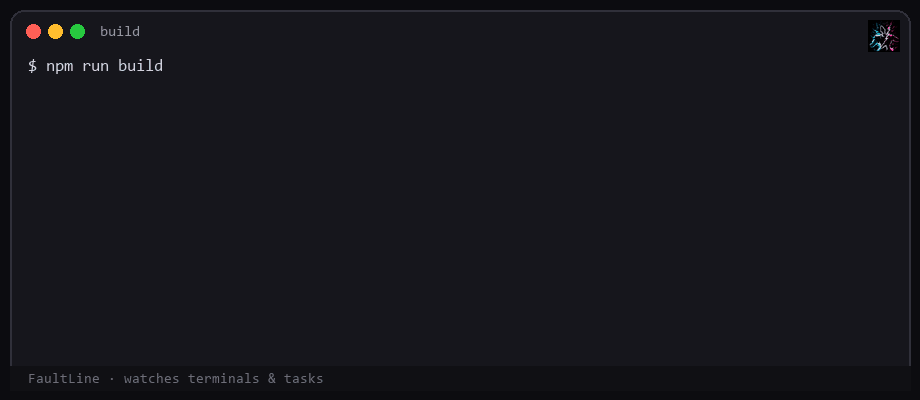

<p align="center">
  
</p>

<h1 align="center">FaultLine</h1>

<p align="center">
  <strong>Debugger and fault explainer for VS Code.</strong><br/>
  Understand terminal and task failures first. Optional sounds and notifications second.
</p>

<p align="center">
  <a href="https://github.com/4nur4gmishr4/vscode-FaultLine-Extension/actions"></a>
  <a href="https://github.com/4nur4gmishr4/vscode-FaultLine-Extension/releases/tag/v3.5.0"></a>
  <a href="LICENSE"></a>
  <a href="https://github.com/4nur4gmishr4/vscode-FaultLine-Extension/stargazers"></a>
</p>

<p align="center">
  
  
  
</p>

---

## What FaultLine is

**First:** a **debugger and fault explainer**. When a terminal command or task fails, FaultLine keeps the failure context and helps you understand it (including optional model-backed explanation when you ask).

**Second:** an **error notifier**. Optional sounds, status bar, toasts, webhooks, and Jira so you notice failures without staring at the panel.

Built by **Anurag Mishra** ([4nur4gmishr4](https://github.com/4nur4gmishr4)) for developers who ship.

### Primary job: catch the fault and explain it

1. Detects failing **terminals**, **tasks**, and optionally **diagnostics**  
2. Stores a sanitized copy of the last failure (command + output when available)  
3. Opens **Analyze Last Failure** when you want a clear explanation and follow-up chat  
4. Supports GitHub Copilot (no key) or other providers you configure  
5. Redacts common secrets before any outbound explanation request  

### Secondary job: notify you

- Optional failure and success **sounds**  
- Status bar + daily fail count  
- Snooze, quiet hours, cooldowns  
- Optional HTTPS webhooks and opt-in Jira  

Auto-open of the analysis panel stays **off** by default. You choose when to open it.

### Watch a failure get caught

<p align="center">
  
</p>

### How it works (3 steps)

<p align="center">
  
</p>

---

## What you get

| You want… | FaultLine does… |
|-----------|------------------|
| Understand a failed command | Keeps last failure and opens analysis on demand |
| Debug without copy-paste | Passes command + output (redacted) into the explainer |
| Pick your model backend | Copilot, OpenRouter, Groq, Gemini, OpenAI, Anthropic, and more |
| Notice fails while coding | Optional sounds, status bar, notifications |
| Stay careful with data | Auto analysis off; keys in SecretStorage; HTTPS webhooks only |

---

## Install

### Marketplace

1. Open VS Code  
2. Extensions, search **FaultLine**  
3. Install  

### GitHub Release (VSIX)

1. Download `faultline.vsix` from [Releases v3.5.0](https://github.com/4nur4gmishr4/vscode-FaultLine-Extension/releases/tag/v3.5.0)  
2. Extensions view, menu, **Install from VSIX…**  

### First install

On first install you see a short typed greeting from Anurag Mishra, then the welcome screen.  
Press **Skip** anytime under the text to jump to the welcome screen.

Reopen later with **FaultLine: Show Welcome Screen** (no typing intro).

### First setup

1. Command Palette  
2. **FaultLine: Open Configuration**  
3. Keep **Copilot** or pick a provider and save a key  
4. Test a sound if you want notifications  
5. Run a failing command, then **FaultLine: Analyze Last Failure**  

---

## Commands

| Command | What it does |
|---------|----------------|
| **FaultLine: Analyze Last Failure** | Open the fault explainer for the last error |
| **FaultLine: Open Configuration** | Settings (providers, sounds, basics) |
| **FaultLine: Toggle Enable / Disable** | Master on/off |
| **FaultLine: Toggle Sounds** | Sounds only |
| **FaultLine: Snooze** | Quiet notifications for a while |
| **FaultLine: Show Output Log** | Extension log channel |
| **FaultLine: Factory Reset** | Clear settings, history, and stored keys |
| **FaultLine: Show Welcome Screen** | Welcome UI without typing intro |

---

## Settings you will use most

Open **FaultLine: Open Configuration**, or search settings:

`@ext:4nur4gmishr4.fahh`

| Setting | Meaning | Default |
|---------|---------|---------|
| `faultline.enabled` | Master switch | on |
| `faultline.errorExplanation.enabled` | Allow fault explanation panel | on |
| `faultline.errorExplanation.autoShow` | Open explainer automatically on fail | **off** |
| `faultline.aiProvider` | Explanation backend | `copilot` |
| `faultline.ai.model` | Model id when not using Copilot | free OpenRouter default |
| `faultline.aiSummary.enabled` | Short summary line in the log | **off** |
| `faultline.soundsEnabled` | Play sounds | on |
| `faultline.volume` | Volume 0 to 100 | 100 |
| `faultline.soundPack` | Failure sound file | built-in pack |
| `faultline.successEnabled` | Success sound | configurable |
| `faultline.cooldownMs` | Min gap between sounds | 2000 |
| `faultline.ignorePatterns` | Skip matching failures (regex) | empty |
| `faultline.webhookUrl` | Outbound notify URL | empty (**https only**) |
| `faultline.jiraEnabled` | Create Jira issues on fail | **off** |

More options (quiet hours, sources, branch filters, allowlists) are in VS Code Settings via **Open all FaultLine settings**.

---

## Privacy and safety

- Explanation **auto-open is off**. You open analysis when you want.  
- API keys use VS Code **SecretStorage**.  
- Common secrets are redacted before outbound explanation calls (best effort).  
- Webhooks require `https://`. Private hosts need an allowlist.  
- Jira is off until you enable it; Atlassian hosts only.  
- **Factory Reset** deletes stored keys.  

Details: [SECURITY.md](./SECURITY.md)

---

## What is new in 3.5.0

- Reliable terminal and task failure capture  
- Fault explainer with last-failure context and optional providers  
- Safer defaults for auto-open analysis and Jira  
- Stronger outbound URL checks (HTTPS, DNS, IP pin)  
- Slim VSIX, automated tests, multi-OS CI, GitHub Releases  
- First-install greeting with Skip  

Full notes: [CHANGELOG.md](./CHANGELOG.md) · [Release v3.5.0](https://github.com/4nur4gmishr4/vscode-FaultLine-Extension/releases/tag/v3.5.0)

---

# For developers and contributors

*Build, review, or extend FaultLine.*

## Architecture at a glance

```text
Terminal / Task / Diagnostics
            |
            v
     FaultLineRuntime.handleFailure
            |
    +-------+--------+----------+----------+
    v       v        v          v          v
  Mute?   PII     History    Sound     Webhook
  Branch  sanitize (capped)  (optional) / Jira
  Ignore
            |
            v
     Explainer panel (on demand, or auto if enabled)
```

| Layer | Folder | Role |
|-------|--------|------|
| Entry | `src/extension.ts` | Activate, config reload, migrations |
| Runtime | `src/application/runtime/` | Failure and success handling |
| Detectors | `src/infrastructure/detectors/` | Terminal, task, diagnostics |
| Services | `src/infrastructure/services/` | Explainer backends, webhooks, Jira |
| Security | `src/infrastructure/security/` | Redaction helpers |
| UI | `src/presentation/` | Commands, webviews, status bar |
| Shared | `src/shared/` | Config, secrets, scheduler, i18n |

More detail: [ARCHITECTURE.md](./ARCHITECTURE.md)

## Local development

```bash
git clone https://github.com/4nur4gmishr4/vscode-FaultLine-Extension.git
cd vscode-FaultLine-Extension
npm ci
npm run vendor:sync
npm run lint
npm test -- --coverage
npm run compile
```

Press **F5** for the Extension Development Host, or:

```bash
npm run package:prod
```

| Script | Purpose |
|--------|---------|
| `vendor:sync` | Copy webview assets into `resources/vendor` |
| `lint` | Typecheck and ESLint |
| `test` | Jest tests |
| `test:integration` | Activate smoke tests |
| `compile` | Bundle to `out/extension.js` |
| `package:prod` | Clean, vendor, compile, package VSIX |
| `docs:gifs` | Regenerate docs media GIFs |

Contributing: [CONTRIBUTING.md](./CONTRIBUTING.md)

## Security notes for engineers

| Control | Behavior |
|---------|----------|
| Secrets | SecretStorage |
| Webhooks | HTTPS only, private host block, DNS re-check, connect IP pin and SNI |
| Jira | Opt-in, HTTPS, Atlassian hosts, origin-only URL |
| Explainer egress | Redaction plus payload size caps |
| Settings webview | Allowlisted keys, key format checks |
| Pack sound test | Basename only under `resources/packs` |

Report issues privately: [SECURITY.md](./SECURITY.md)

## Tests and CI

- Jest unit and integration smoke tests  
- GitHub Actions on Windows, Linux, macOS  
- Release workflow on `v*` tags attaches `faultline.vsix`  
- CodeQL and pinned TruffleHog  

## Project links

| | |
|--|--|
| Source | https://github.com/4nur4gmishr4/vscode-FaultLine-Extension |
| Releases | https://github.com/4nur4gmishr4/vscode-FaultLine-Extension/releases |
| Issues | https://github.com/4nur4gmishr4/vscode-FaultLine-Extension/issues |
| License | [MIT](./LICENSE) |

## Media

Three animations in [`docs/media/`](./docs/media/README.md):

| File | Where used |
|------|------------|
| `logo-pulse.gif` | Header (project logo) |
| `terminal-fail.gif` | Failure demo |
| `how-it-works.gif` | Three-step flow |

Regenerate: `npm run docs:gifs`

---

<p align="center">
  <strong>FaultLine 3.5.0</strong><br/>
  Debugger and fault explainer first. Notifier second.<br/>
  Made by Anurag Mishra for developers everywhere · MIT
</p>
