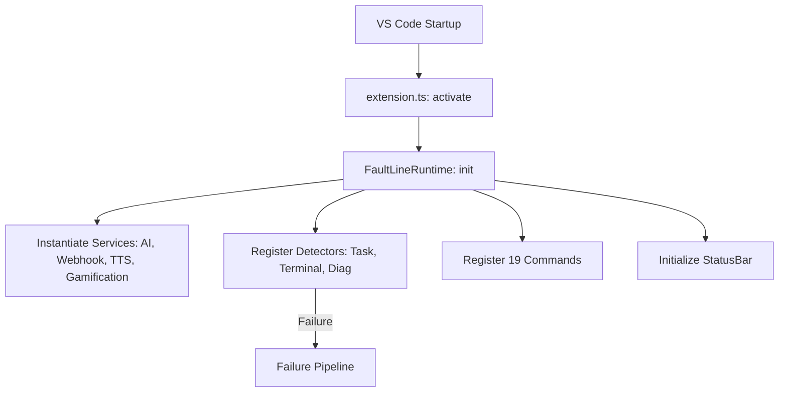
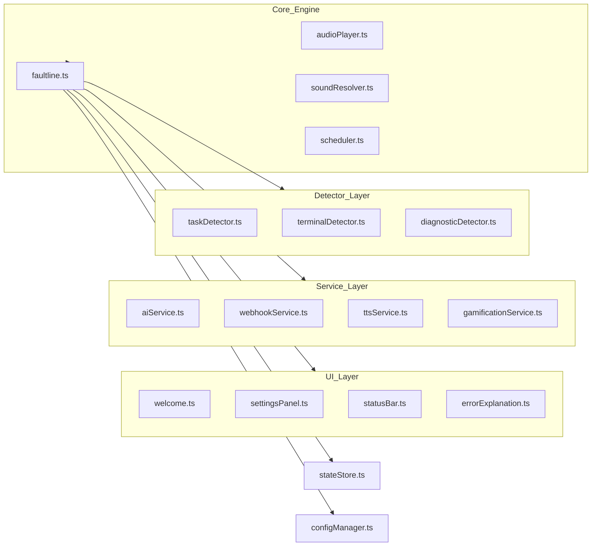
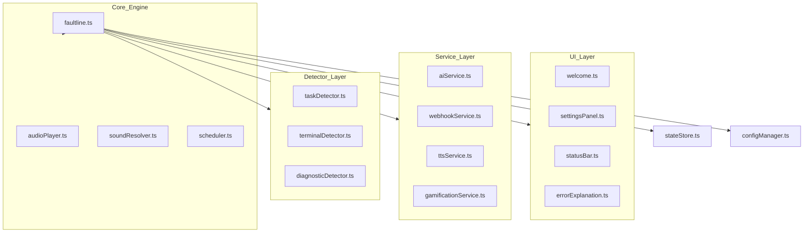

# FaultLine Repository Knowledge Base: The Definitive Encyclopedia

**Product Name:** FaultLine (Previously Fahh)  
**Version:** 3.0.0  
**Target Standard:** Google, Microsoft VS Code Team, GitHub Developer Experience

---

## 1. Executive Summary
FaultLine is a high-performance, security-hardened VS Code extension that transforms the developer experience by converting silent failures into immediate auditory signals and AI-powered insights. It solves the "visual tax" problem where developers must constantly scan for errors, allowing them to stay in "flow state" longer. This document provides a complete, exhaustive mapping of every file, command, setting, and workflow in the repository.

---

## 2. Product Encyclopedia

### Core Value Proposition
- **Auditory Debugging**: Instant realization of failures without visual context switching.
- **AI Root Cause Analysis**: Automated explanation of errors using local PII redaction and secure LLM calls.
- **Enterprise Grade**: 100% SecretStorage compliance, zero runtime dependencies, and strict SSRF/RCE protection.

### Competitive Analysis
| Feature | FaultLine | Error Lens | GitHub Copilot | SonarLint |
| :--- | :---: | :---: | :---: | :---: |
| **Audio Alerts** | ✅ Yes | ❌ No | ❌ No | ❌ No |
| **Proactive AI** | ✅ Yes | ❌ No | ⚠️ Partial | ❌ No |
| **Task Monitoring** | ✅ Yes | ❌ No | ❌ No | ❌ No |
| **Zero Runtime Dep** | ✅ Yes | ⚠️ High | ⚠️ High | ⚠️ High |

---

## 3. Architecture Encyclopedia

### Extension Activation Flow
1. **Extension Host**: VS Code initializes the extension host process.
2. **OnStartupFinished**: The extension is activated when the editor is idle to avoid CPU spikes.
3. **`activate(ctx)`**: Entry point in `src/extension.ts` is called.
4. **`FaultLineRuntime`**: The main orchestrator is instantiated.
5. **Detector Registration**: Sensors for Tasks, Terminals, and Diagnostics are wired to the event bus.

### Runtime Lifecycle Diagram

### Complete Runtime Graph

---

## 4. Source File Encyclopedia (Complete Registry)

### **Orchestration Layer**
- **`src/extension.ts`**
    - **Purpose**: Entry point. Maps VS Code lifecycle to extension logic.
    - **Imports**: `vscode`, `FaultLineRuntime`, `registerCommands`, `WelcomePanel`, `setLanguage`.
    - **Public API**: `activate()`, `deactivate()`.
- **`src/runtime/faultline.ts`**
    - **Purpose**: Internal runtime controller. Manages service lifecycles and event bus.
    - **Imports**: `vscode`, `Services`, `Detectors`, `StateStore`, `PII`.
    - **Public API**: `activate()`, `registerDetectors()`, `handleFailure()`.

### **Sensory Layer (Detectors)**
- **`src/detectors/taskDetector.ts`**: Monitors `vscode.tasks` for non-zero exit codes.
- **`src/detectors/terminalDetector.ts`**: Monitors shell integration for command failures.
- **`src/detectors/diagnosticDetector.ts`**: Monitors code linting errors with a 500ms debounce.
- **`src/detectors/index.ts`**: Module barrel.

### **Capability Layer (Services)**
- **`src/services/aiService.ts`**: Provider registry and LLM request handling.
- **`src/services/webhookService.ts`**: Notifications for Slack/Discord with SSRF protection.
- **`src/services/ttsService.ts`**: Secure cross-platform Text-to-Speech execution.
- **`src/services/gamificationService.ts`**: Engagement logic (Boss HP, Streaks).
- **`src/services/aiProviders.ts`**: Configuration for 11 LLM backends.
- **`src/services/index.ts`**: Module barrel.

### **Infrastructure & Data Layer**
- **`src/config/configManager.ts`**: Mapping flat settings to nested domain models.
- **`src/config/secretManager.ts`**: Secure interaction with encrypted `SecretStorage`.
- **`src/config/constants.ts`**: Centralized IDs, default values, and paths.
- **`src/state/stateStore.ts`**: Typed interface for global `Memento` state.
- **`src/security/pii.ts`**: Redaction engine for error message privacy.
- **`src/types/index.ts`**: Core TypeScript definitions for the extension.

### **Core Systems Layer**
- **`src/core/audioPlayer.ts`**: Binary execution for low-latency sound playback.
- **`src/core/soundResolver.ts`**: Mapping failure events to `.mp3` assets.
- **`src/core/wsl.ts`**: Bridging for Windows Subsystem for Linux path compatibility.

### **UI Component Layer**
- **`src/ui/statusBar.ts`**: Status Bar UI.
- **`src/ui/welcome.ts`**: Integrated sound pack and AI provider selection screen.
- **`src/ui/errorExplanation.ts`**: Analysis Webview.
- **`src/ui/settingsPanel.ts`**: Config Webview with "Apply" workflow.

### **Command Domain Layer**
- **`src/commands/historyCommands.ts`**: History replay/export.
- **`src/commands/soundCommands.ts`**: Audio tests/picking.
- **`src/commands/stateCommands.ts`**: Toggles and resets.
- **`src/commands/uiCommands.ts`**: Webview panel orchestration.
- **`src/commands/index.ts`**: Global registration dispatcher.

---

## 5. Command Encyclopedia (End-to-End)

| Command ID | Display Name | Internal Path | Trigger |
| :--- | :--- | :--- | :--- |
| `faultline.test` | Play Test Sound | `SoundResolver` -> `AudioPlayer` | Palette |
| `faultline.openSettings` | Open Configuration | `SettingsPanel.createOrShow` | Palette/Welcome |
| `faultline.explainError` | Analyze Last Failure | `AIService` -> `ErrorExplanationManager` | Palette/Sidebar |
| `faultline.snooze` | Snooze | `Scheduler.snooze()` | Status Bar |
| `faultline.replaySound` | Replay Sound | `HistoryManager` -> `AudioPlayer` | Sidebar |
| `faultline.clearHistory` | Clear History | `HistoryManager.clear()` | Sidebar |
| `faultline.factoryReset` | Factory Reset | Full state/config purge | Palette |

---

## 6. Settings Encyclopedia (The 3.0 Nested Model)

| Domain | Key Path | Default | Runtime Impact |
| :--- | :--- | :--- | :--- |
| **Core** | `faultline.core.enabled` | `true` | Master switch. |
| **Core** | `faultline.core.language` | `"en"` | Localization. |
| **Audio** | `faultline.audio.volume` | `100` | Playback gain. |
| **Audio** | `faultline.audio.soundPack` | `"default"`| Sound assets dir. |
| **AI** | `faultline.ai.provider` | `"copilot"` | LLM backend. |
| **Detection** | `faultline.detection.sources` | `[task, shell, diag]` | Filters events. |

---

## 7. Event Flow Encyclopedia

### 1. Failure Capture Flow
1.  **Detector Capture**: `TaskDetector` captures non-zero exit.
2.  **Scheduler Filtering**: Verifies cooldown and quiet hours.
3.  **Local Redaction**: `PII` Redactor scrubs emails and local paths.
4.  **Audio Engine**: `AudioPlayer` spawns playback process.
5.  **Analytics**: `AIService` performs root-cause summary.
6.  **UI Feedback**: `StatusBar` counter increments and red-flash triggers.

---

## 8. Security Encyclopedia

- **Vaulting**: All credentials stored in OS keychain via `SecretStorage`.
- **Privacy**: Local scrubbing via `security/pii.ts` with state-resetting regex.
- **SSRF Shield**: Host validation against private IP ranges in `webhookService.ts`.
- **RCE Prevention**: Base64 encoded PowerShell scripts for all TTS.

---

## 9. Testing Encyclopedia (14 suites, 141 tests)

- **`security.test.ts`**: Verifies 100% of PII patterns.
- **`configManager.test.ts`**: Verifies nested object mapping.
- **`commands.test.ts`**: Verifies manifest registration sync.
- **`activation.test.ts`**: Verifies system bootstrap.

---

## 10. Dependency & Release Encyclopedia

### Production
- **None**. (Native Node.js + VS Code APIs).

### Development
- `@vscode/webview-ui-toolkit`: Microsoft native webview styling.
- `typescript`: Static typing.
- `jest`: Quality assurance.

### CI/CD
- **`ci.yml`**: Lint, Compile, Test, Audit.
- **`security.yml`**: CodeQL and TruffleHog.
- **`release.yml`**: Automated VSIX tag-driven publish.

---

## 11. Knowledge Graph (Universal)

---
*Encyclopedia completed by Principal Engineering Review, June 2026.*
